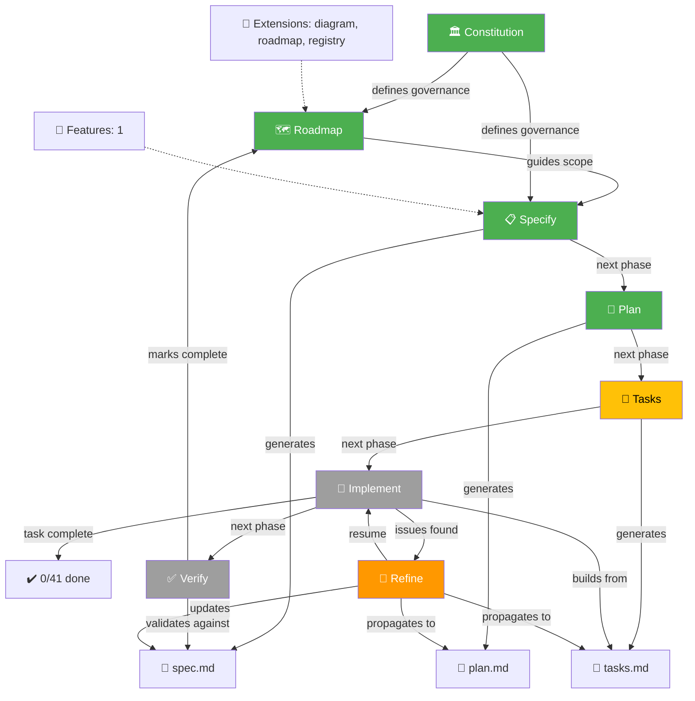

# SideProjectAIdvisor

A web application that analyzes job offers and generates tailored side project proposals to help candidates land their target roles.

## Tech Stack

| Layer | Technology |
|-------|-----------|
| **Framework** | Next.js 15.5 (App Router) |
| **Language** | TypeScript 5.8 (strict mode) |
| **Styling** | Tailwind CSS 4 + MUI 7 + Radix UI primitives |
| **State / Forms** | React 18.3, react-hook-form |
| **Charts** | Recharts |
| **Database** | Postgres on Neon |
| **ORM** | Drizzle ORM |
| **Auth** | Supabase Auth |
| **AI / LLM** | Vercel AI SDK |
| **Email** | Resend + React Email |
| **Deployment** | Vercel (serverless) |
| **Monorepo** | pnpm workspaces + Turborepo |
| **Linting** | ESLint + Prettier |

## Installation

```bash
# Prerequisites: Node.js 20+, pnpm 11+
pnpm install
```

### Environment

Copy `.env` to `.env.local` and fill in the values:

```bash
cp .env .env.local
```

Required variables:

| Variable | Description |
|----------|-------------|
| `NEXT_PUBLIC_SUPABASE_URL` | Supabase project URL |
| `NEXT_PUBLIC_SUPABASE_ANON_KEY` | Supabase anonymous key |

### Run Development Server

```bash
pnpm dev
```

Opens at [http://localhost:3000](http://localhost:3000).

### Quality Gates

```bash
pnpm lint          # ESLint
pnpm typecheck     # TypeScript strict mode
pnpm test          # Test suite
pnpm build         # Production build
```

All four MUST pass before merging.

## Project Structure

```
.
├── apps/
│   └── web/             # Next.js App Router (the only deployable)
│       ├── src/
│       │   ├── app/     # Route handlers and pages
│       │   ├── components/
│       │   ├── features/
│       │   ├── lib/
│       │   └── styles/
│       └── tests/
├── packages/
│   └── config/          # Shared tsconfig + ESLint presets
├── specs/               # Feature specifications (SDD)
├── .agents/
│   └── skills/          # Engineering agents
├── docs/                # Deep-dive documentation
│   ├── backend/
│   │   ├── api.md
│   │   ├── auth.md
│   │   ├── database.md
│   │   ├── email.md
│   │   ├── jobs.md
│   │   └── payments.md
│   ├── frontend.md
│   ├── infra.md
│   ├── monorepo.md
│   └── typescript.md
└── .specify/            # Spec-Driven Development configuration
    ├── memory/
    │   ├── constitution.md  # Project governance principles
    │   └── roadmap.md       # Spec roadmap ledger
    ├── extensions/
    │   ├── diagram/
    │   └── roadmap/
    └── templates/           # SDD artifact templates
```

## Agents

This project uses [opencode agents](https://opencode.ai) for AI-assisted development. Installed skills:

| Skill | Source | Purpose |
|-------|--------|---------|
| `grill-with-docs` | mattpocock/skills | Structured design critique and ADR generation |
| `speckit-diagram-dependencies` | local | Mermaid DAG of task dependencies |
| `speckit-diagram-status` | local | Mermaid feature progress dashboard |
| `speckit-diagram-workflow` | local | Mermaid SDD lifecycle flowchart |

## Spec-Driven Development (SDD)

Features follow: **Specify → Plan → Tasks → Implement → Verify**, with a refine loop.

### Workflow



### Status

```mermaid
gantt
    title SDD Feature Progress
    dateFormat X
    axisFormat %s

    section 001-user-login
    Specify     :done, spec1, 0, 1
    Plan        :done, plan1, 1, 2
    Tasks       :task1, 2, 3
    Implement   :impl1, 3, 4
    Verify      :veri1, 4, 5
```



| Feature | Phase | Tasks | Status |
|---------|-------|-------|--------|
| 001-user-login | Tasks | 0/41 | Active |

### Task Dependencies

```mermaid
flowchart LR
    subgraph Wave1["Wave 1: Setup"]
        direction TB
        T001["T001: Install deps"]
        T002["T002 [P]: Dir structure"]
        T003["T003 [P]: Browser client"]
        T004["T004 [P]: Server client"]
        T005["T005: Session middleware"]
    end

    subgraph Wave2["Wave 2: Foundational"]
        direction TB
        T006["T006: Next.js middleware"]
        T007["T007 [P]: Auth actions types"]
        T008["T008: Auth layout"]
        T009["T009 [P]: .env.local"]
    end

    subgraph Wave3["Wave 3: US1 — Sign Up"]
        direction TB
        T010["T010 [P]: Signup form test"]
        T011["T011 [P]: signUp action test"]
        T012["T012: signUp action"]
        T013["T013 [P]: Signup page"]
        T014["T014 [P]: Signup form"]
        T015["T015: Wire signup"]
    end

    subgraph Wave4["Wave 4: US2 — Log In"]
        direction TB
        T016["T016 [P]: Login form test"]
        T017["T017 [P]: signIn action test"]
        T018["T018: signIn action"]
        T019["T019 [P]: Login page"]
        T020["T020 [P]: Login form"]
        T021["T021: Wire login"]
        T022["T022: Auth redirect"]
    end

    subgraph Wave5["Wave 5: US3 — Log Out"]
        direction TB
        T023["T023 [P]: signOut test"]
        T024["T024 [P]: Auth header test"]
        T025["T025: signOut action"]
        T026["T026 [P]: Auth header"]
        T027["T027: Integrate header"]
    end

    subgraph Wave6["Wave 6: US4 — Password Reset"]
        direction TB
        T028["T028 [P]: resetPassword test"]
        T029["T029 [P]: updatePassword test"]
        T030["T030: resetPassword action"]
        T031["T031: updatePassword action"]
        T032["T032 [P]: Forgot pwd page"]
        T033["T033 [P]: Forgot pwd form"]
        T034["T034 [P]: Update pwd page"]
        T035["T035 [P]: Auth callback"]
    end

    subgraph Wave7["Wave 7: Polish"]
        direction TB
        T036["T036 [P]: Login rate limit"]
        T037["T037 [P]: Reset rate limit"]
        T038["T038 [P]: Error boundary"]
        T039["T039: Quickstart validation"]
        T040["T040 [P]: Accessibility"]
        T041["T041: lint+typecheck+test+build"]
    end

    Wave1 --> Wave2
    Wave2 --> Wave3
    Wave2 --> Wave4
    Wave3 --> Wave4
    Wave4 --> Wave5
    Wave3 --> Wave6
    Wave4 --> Wave6
    Wave5 --> Wave7
    Wave6 --> Wave7

    style Wave1 fill:#e8f5e9,stroke:#4CAF50
    style Wave2 fill:#e8f5e9,stroke:#4CAF50
    style Wave3 fill:#FFF9C4,stroke:#FFC107
    style Wave4 fill:#FFF9C4,stroke:#FFC107
    style Wave5 fill:#FFF9C4,stroke:#FFC107
    style Wave6 fill:#FFF9C4,stroke:#FFC107
    style Wave7 fill:#E3F2FD,stroke:#2196F3
```



**Critical path**: Wave 1 → Wave 2 → Wave 3 → Wave 4 → Wave 5/6 → Wave 7

| Stat | Value |
|------|-------|
| Total tasks | 41 |
| Execution waves | 7 |
| Parallel tasks | 27 (66%) |
| Completed | 0 |
| MVP scope | Waves 1–3 (Sign Up only, 15 tasks) |
