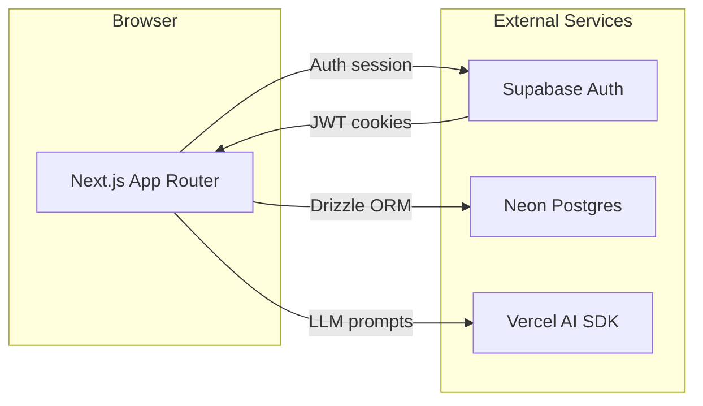
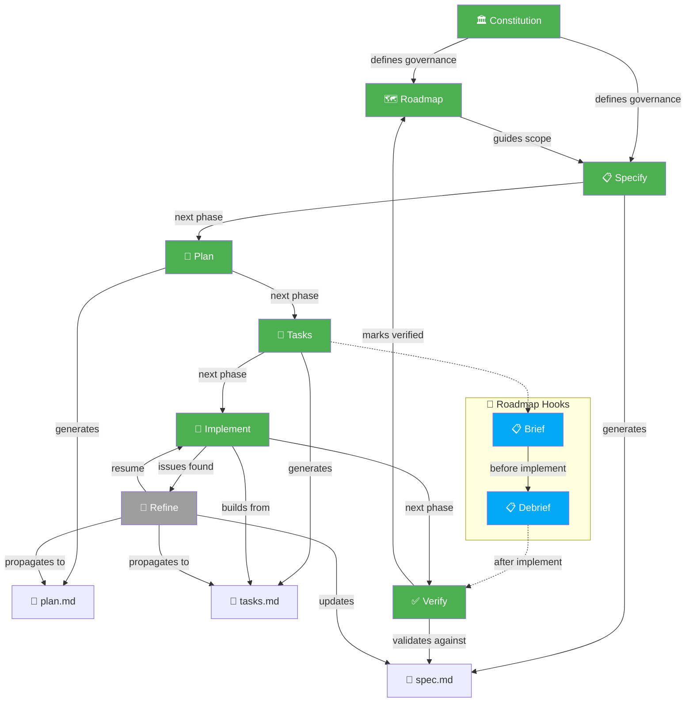
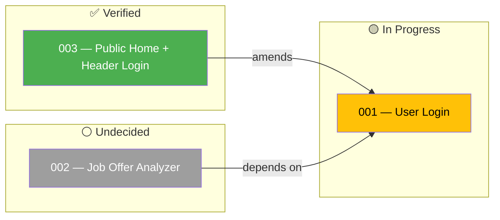

<p align="center">
  
</p>

<p align="center">
  A web application that analyzes job offers and generates tailored side project proposals to help candidates land their target roles.
</p>

<p align="center">
  <a href="https://sideprojectadvisor.vercel.app"></a>
  
  
  
  
  
</p>

---

<details>
<summary><b>📖 Table of Contents</b></summary>

- [Why?](#why)
- [Features](#features)
- [Screenshot](#screenshot)
- [Architecture](#architecture)
- [Tech Stack](#tech-stack)
- [Installation](#installation)
- [Project Structure](#project-structure)
- [Agents](#agents)
- [Spec-Driven Development](#spec-driven-development-sdd)
- [Contributing](#contributing)
- [License](#license)

</details>

---

## Why?

Job seekers often struggle to stand out. Generic advice like "build a portfolio project" doesn't align with what recruiters actually want.

SideProjectAIdvisor bridges the gap: you paste a job offer URL, and it produces **3 tailored side project proposals** — ranked Easy, Medium, Hard — using the exact tech stack the role demands, each with a build roadmap.

## Features

- 📄 **Job offer analysis** — paste a URL, get an instant tech stack breakdown
- 🎯 **3 tailored proposals** — Easy / Medium / Hard, matched to the role
- 🗺️ **Build roadmaps** — step-by-step guides for each project
- 🔐 **User accounts** — sign up, log in, password reset (Supabase Auth)
- 🧠 **AI-powered** — Vercel AI SDK generates personalized recommendations

## Screenshot

> *Screenshot coming soon. The app is under active development.*

## Architecture



## Tech Stack

| Layer | Technology |
|-------|-----------|
| **Framework** | Next.js 15.5 (App Router) |
| **Language** | TypeScript 5.8 (strict mode) |
| **Styling** | Tailwind CSS 4 + MUI 7 + Radix UI primitives |
| **State / Forms** | React 18.3, react-hook-form |
| **Charts** | Recharts |
| **Database** | Postgres on Neon |
| **ORM** | Drizzle ORM |
| **Auth** | Supabase Auth |
| **AI / LLM** | Vercel AI SDK |
| **Email** | Resend + React Email |
| **Deployment** | Vercel (serverless) |
| **Monorepo** | pnpm workspaces + Turborepo |
| **Testing** | Playwright (e2e) |
| **Linting** | ESLint + Prettier |

## Installation

```bash
# Prerequisites: Node.js 20+, pnpm 11+
pnpm install
```

### Environment

Copy `.env` to `.env.local` and fill in the values:

```bash
cp .env .env.local
```

Required variables:

| Variable | Description |
|----------|-------------|
| `NEXT_PUBLIC_SUPABASE_URL` | Supabase project URL |
| `NEXT_PUBLIC_SUPABASE_ANON_KEY` | Supabase anonymous key |

### Run Development Server

```bash
pnpm dev
```

Opens at [http://localhost:3000](http://localhost:3000).

### Test User

A pre-seeded test user is available for development and testing:

```
Email:    test@sideprojectadvisor.com
Password: Test1234
```

Seed it (requires `SUPABASE_SERVICE_ROLE_KEY` in `apps/web/.env`):

```bash
pnpm --filter @advisor/web seed
```

### Quality Gates

```bash
pnpm lint          # ESLint
pnpm typecheck     # TypeScript strict mode
pnpm test          # Playwright e2e suite
pnpm build         # Production build
```

All four MUST pass before merging.

## Project Structure

```
.
├── apps/
│   └── web/             # Next.js App Router (the only deployable)
│       ├── src/
│       │   ├── app/     # Route handlers and pages
│       │   ├── components/
│       │   ├── features/
│       │   ├── lib/
│       │   └── styles/
│       └── tests/
├── packages/
│   └── config/          # Shared tsconfig + ESLint presets
├── specs/               # Feature specifications (SDD)
├── .agents/
│   └── skills/          # Engineering agents
├── docs/                # Deep-dive documentation
│   ├── backend/
│   │   ├── api.md
│   │   ├── auth.md
│   │   ├── database.md
│   │   ├── email.md
│   │   ├── jobs.md
│   │   └── payments.md
│   ├── frontend.md
│   ├── infra.md
│   ├── monorepo.md
│   └── typescript.md
└── .specify/            # Spec-Driven Development configuration
    ├── memory/
    │   ├── constitution.md  # Project governance principles
    │   └── roadmap.md       # Spec roadmap ledger
    ├── extensions/
    │   ├── diagram/
    │   └── roadmap/
    └── templates/           # SDD artifact templates
```

## Agents

This project uses [opencode agents](https://opencode.ai) for AI-assisted development. Installed skills:

| Skill | Source | Purpose |
|-------|--------|---------|
| `grill-with-docs` | mattpocock/skills | Structured design critique and ADR generation |
| `speckit-diagram-dependencies` | local | Mermaid DAG of task dependencies |
| `speckit-diagram-status` | local | Mermaid feature progress dashboard |
| `speckit-diagram-workflow` | local | Mermaid SDD lifecycle flowchart |

## Spec-Driven Development (SDD)

Features follow: **Specify → Plan → Tasks → Implement → Verify**, with a refine loop.

### SDD Workflow



### Feature Progress

```mermaid
gantt
    title SDD Feature Progress
    dateFormat X
    axisFormat %s

    section 001 — User Login
    Specify     :done, s1, 0, 1
    Plan        :done, p1, 1, 2
    Tasks       :done, t1, 2, 3
    Implement   :active, i1, 3, 4
    Verify      :v1, 4, 5

    section 003 — Public Home + Header Login
    Specify     :done, s2, 0, 1
    Plan        :done, p2, 1, 2
    Tasks       :done, t2, 2, 3
    Implement   :done, i2, 3, 4
    Verify      :done, v2, 4, 5
```



| Feature | Phase | Tasks | Status |
|---------|-------|-------|--------|
| 001 — User Login | Implement | 0/41 | 🟡 in-progress |
| 003 — Public Home + Header Login | Verify | 29/29 | ✅ verified |

### Spec Roadmap



| Spec | Status | Description |
|------|--------|-------------|
| 001 | 🟡 in-progress | Email/password auth via Supabase Auth |
| 002 | ⚪ undecided | Core job-offer analysis & side-project proposals |
| 003 | ✅ verified | Public home Page with Header Login Button |

> Roadmap ledger: `.specify/memory/roadmap.md` (v1.1.2)

---

<a name="contributing"></a>
## Contributing

Contributions are welcome! Open an issue or pull request.

<a name="license"></a>
## License

[MIT](LICENSE)
